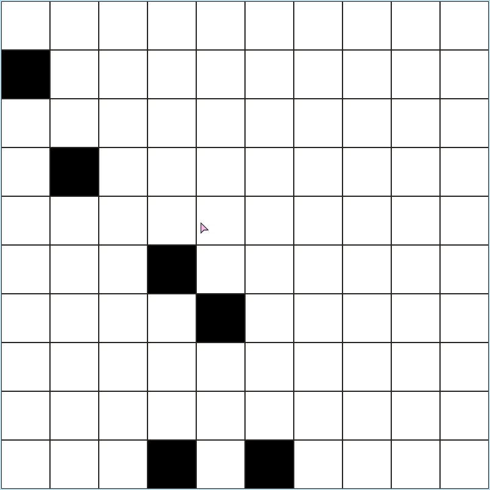

# Tap Fast

Kind of like that online piano tiles game, but with way higher customizability; mainly to improve your clicks--their accuracy and speed.

Still a work in progress; I stopped half way because python just isn't cutting it when it's subject to a higher load. I.e, the update of the tiles is sluggish/slow when you're actually clicking fast; this will likely get worse with more tiles. So I was thinking about porting it over to Rust [as a learning project as well].

